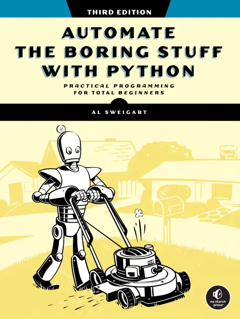

## 👋 Welcome

- We all automate more than we realize:
  - Setting up filters in Gmail
  - Using “Remember Me” on websites
  - Writing scripts or Excel macros

But there's always more you can learn!

---

![[Pasted image 20250718161532.png]]
[link](https://www.reddit.com/r/ProgrammerHumor/comments/w5nzpz/omg_i_swear_this_is_me_every_single_time_i_have/)

---

![[Pasted image 20250718161608.png]]
[link](https://xkcd.com/1319/)

---

## 🕐 Why Do We Automate?

- Saves time on repetitive, boring tasks  
- Reduces mistakes and “oops, I forgot” moments  
- Lets you reclaim attention for more important work (less context switching)
- _“If you do something more than twice, consider automating it.”_

---

## ⚙️ Classic Automation We Already Know

- script/batch files  
	- cron jobs
	- `rsync`
- IFTTT
	- browser extensions  
	- mail merge  
- Excel macros
- Keyboard shortcuts
- App defaults
- ...

- ✅ Powerful, but often limited to **one platform**, **one device**, or **power users only**

---
## 🚀 Added "Modern" Automation Options

- Native mobile automation
- Web-to-web app automation
- (+ Application-native automation)

---

## 📱 1. Native Phone Automations

### iOS (Shortcuts & Automations)
- Auto-text someone when leaving home  
- Turn on Focus mode when arriving at work  
- Tap a home-screen icon to trigger a multi-step routine
- Perform a settings change at certain time of day

### Android (Tasker or built-in routines)
- Change settings based on location/Wi-Fi  
- Auto-play Spotify when you connect headphones  
- Silence notifications when calendar says "Busy"
- Do task when scan a certain QR code

---

## 🌐 2. Web-to-Web (and local) Automation (Zapier, n8n, Windmill.dev)

These connect multiple apps together — like **digital data piping**.

---

:::: {.columns}

::: {.column width="60%"}

### Zapier
- No-code automations for 1000s of web apps
- Ex: When a new row is added in Google Sheets → add to CRM -%3E Add card to Trello -> Send a warm-up email
- Ex. Once a day -> loop through list of contacts -> calculate some values -> output to Google Sheets
:::

::: {.column width="40%"}

:::

::::

---

:::: {.columns}

::: {.column width="60%"}
### [n8n](https://github.com/n8n-io/n8n) (Source Available)
- Visual workflows with API, webhook, database support  
- Self-host/run locally for privacy + flexibility  
- Works with your own files and servers

:::

::: {.column width="40%"}

:::

::::

---

:::: {.columns}

::: {.column width="60%"}

### [Windmill.dev](https://github.com/windmill-labs/windmill) (Open Source)
- Script-driven automation with Python/JS/SQL/other languages
- Self-host/run locally for privacy + flexibility  
- Advanced workflows for devs & sysadmins
- Supports cron + triggers + local execution

:::

::: {.column width="40%"}

:::

::::

---

## ⚖️ 3. When to Use What

Considerations:
1. Maximal reliability
2. Lessen your effort to set up
3. Privacy

**What do you think:**
Want to automate process local files on your computer?
- downloaded apps, scripts (with or without windmill), cron jobs
Want to automate the flow of data between web-based applications?
- Zapier or hosted n8n/windmill if need 99% uptime, self-host n8n/windmill if want "more" privacy
Want to flow data within a single web-based application?
- See if that application has automations within it first!
- It is unlikely the developers of that application have less automation ability than something that just hooks into its API, like Zapier.

**Choose the tool that fits your scope**:  
- Use built-ins first (if exist)
- Use cloud services for app-to-app  
- Use local tools for privacy, scale, or file access

---

## Example with Zapier and Trello

- Yap, yap, yap...

---

## 🔁 Stack Automations for Extra Power

- Use iOS Shortcuts or Tasker to **trigger** Zapier workflows via webhooks
- Chain multiple actions: “When I get home → log the time → turn off Slack → start relaxing music”

---

## 🧰 Tools to Explore

### Phones  
- iOS Shortcuts app  
- Android Tasker / Bixby Routines / Google Routines  

### Web Services  
- [zapier.com](https://zapier.com) – plug-and-play  
- [n8n.io](https://n8n.io) – visual, self-hostable  
- [windmill.dev](https://windmill.dev) – scripted and powerful  

### Local Power Tools  
- cron, bash scripts, Python  
- Power Automate (Windows), Automator (Mac)
- n8n/windmill.dev

---

## ❌ What I Didn't Discuss

- Usage of Artificial Intelligence
	- At least, not explicitly
- Proprietary or in-house tools
	- I don't know your work!
- Every option available to you
	- [GitHub - Awesome-Selfhosted>Automation](https://github.com/awesome-selfhosted/awesome-selfhosted?tab=readme-ov-file#automation)

--- 

## 💬 Final Thoughts

✅ You already understand automation  
✅ These tools take it to the next level  
✅ Start small, build momentum  

---

## Sources

### Tasker
https://github.com/guifelix/awesome-tasker
https://thetaskerapp.com/tasker-plugins/
https://zight.com/blog/ios-shortcuts/

### misc
https://automatetheboringstuff.com/